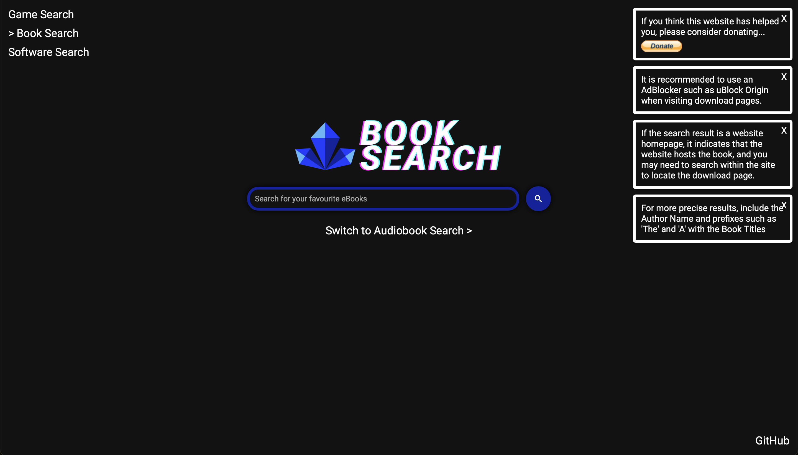

# Rave Book Search Engine
Rave Book Seach Engine assists users in discovering free eBook and Audiobook downloads. It has a list of sources that are regularly updated and verified for safety as well as new eBook/Audiobook download links.
All of the websites listed and indexed by the Rave Book Search Engine have been thoroughly verified to ensure their safety.

# Screenshots

# Features
- Assists in the finding of free eBook and Audiobook download links
- Only indexes links confirmed to be virus-free.
- Supports direct searches via browser address bars
- Uses Google search indexing to provide results quickly
- Simple UI for easy use

# Setting-up Direct URL Search
## eBook Search
1. Visit the Search Engine settings on your browser
2. Click the '+', 'add new search engine' button (or an equivallent on your browser)
3. Fill in the required information:
  - Name: Rave eBook Search
  - Nickname: rbs
  - URL: https://ravebooksearch.com/index.html?q=%s (please note that the '%s' keyword substitute may be different across browsers, kindly follow the instructions provided on your browser to replace if needed.) 
## Audiobook Search
1. Visit the Search Engine settings on your browser
2. Click the '+', 'add new search engine' button (or an equivallent on your browser)
3. Fill in the required information:
  - Name: Rave Audiobook Search
  - Nickname: ras
  - URL: https://ravebooksearch.com/index-audiobooks.html?q=%s (please note that the '%s' keyword substitute may be different across browsers, kindly follow the instructions provided on your browser to replace if needed.) 

# Websites Indexed (Currently 133)
## eBooks (Currently 118)
- libgen.fun
- pdfdrive.com/*
- repec.org/*
- snti.ru/*
- magazinelib.com/*
- avxhome.se/*
- freebookspot.club/*
- librs.net/*
- booksc.org/*
- ebookjunkie.com/*
- onlineprogrammingbooks.com/*
- perlego.com/*
- bookboon.com/*
- broward.org/*
- ebookee.com/*
- free-ebooks.net/*
- oll.libertyfund.org/*
- 2020ok.com/*
- ebb.la/*
- textbooknova.com/*
- pdfchm.net/*
- ebook3000.com/*
- bookfi.net/*
- scienceopen.com/*
- pdfbooksworld.com/*
- feedbooks.com/*
- doaj.org/*
- plos.org/*
- dlc.dlib.indiana.edu/*
- paperity.org/*
- dblp.org/*
- zenodo.org/*
- forcoder.su/*
- filepursuit.com/*
- paidshitforfree.com
- manybooks.net
- freebooks.com
- ibookpile.net
- epdf.tips
- oceanofpdf.com
- ebookbb.com
- gutenberg.org
- allbooksworld.com
- ebooklobby.com
- freetechbooks.com
- freecomputerbooks.com
- onlinebooks.library.upenn.edu
- grtbooks.com
- bygosh.com
- bookgoldmine.com
- pdfget.com
- yudhacookbook.my.id
- espaebook2.com
- standardebooks.org/books
- sanet.st/full
- ebook-hunter.org/books
- ebookelo.com
- kupdf.net
- pdfroom.com
- lelivros.love
- trantor.is
- dokumen.pub
- *.ebook-dl.com/*
- *.ereads.net/*
- *.readanybook.com/*
- *.d-pdf.com/*
- *.avalonlibrary.net/*
- *.bookscat.org/*
- *.bookree.org/*
- *.ebook3000.co/*
- *.booksvooks.com/*
- *.oceanofepub.com/*
- *.letmeread.net/*
- *.onlybooks.org/*
- *.ebookscart.com/*
- *.novel12.com/*
- *.globalgreyebooks.com/*
- *.bookyards.com/*
- *.digilibraries.com/*
- *.bookscafe.net/*
- *.celz.ru/*
- *.fullbooks.com/*
- *.ebook-mecca.com/*
- *.ebook4expert.net/*
- *.thefreeonlinenovel.com/*
- *.readonlinefreebook.com/*
- *.allbookshub.com/*
- *.ebooksz.net/*
- *.bbooks.info/*
- *.novels80.com/*
- *.myebooksfree.com/*
- *.e-booksdirectory.com/*
- *.ebookhunter.net/*
- *.loyalbooks.com/*
- *.getfreeebooks.com/*
- *.obooko.com/*
- *.haringebook.com/*
- *.goodfileshare.com/*
- *.digitalbook.io/*
- *.pdfgeni.com/*
- *.pdfgrab.com/*
- *.ebookpdf.com/*
- *.moam.info/*
- *.pdfcookie.com/*
- *.pdfsearches.com/*
- *.oiipdf.com/*
- *.pdfslide.net/*
- *.qdoc.tips/*
- *.pdfduck.com/*
- *.pdforigin.club/*
- *.freeditorial.com/*
- *.zoboko.com/*
- *.hundredzeros.com/*
- *.freereadfeed.com/*
- *.avxhm.se/*
- *.avaxhome.co/*
- https://annas-archive.org
- 1lib.to
## Comics (Currently 4)
- getcomics.info
- zipcomic.com
- newcomic.info
- comics-all.com
- libgen.gs
## Audiobooks (Currently 11)
- audiobooksbay.ch/*
- loyalbooks.com
- xaudiobo0ks.com
- audiobookbay.nl
- audiboi.com
- tokybook.com
- goldenaudiobooks.com
- galaxyaudiobook.com
- audiobooklabs.com
- audiobooks4soul.com

# Additional Info
## Terms of Use

Certain features of the Site may be subject to additional guidelines, terms, or rules, which will be posted on the Site in connection with such features.

All such additional terms, guidelines, and rules are incorporated by reference into these Terms.

These Terms of Use described the legally binding terms and conditions that oversee your use of the Site. BY LOGGING INTO THE SITE, YOU ARE BEING COMPLIANT THAT THESE TERMS and you represent that you have the authority and capacity to enter into these Terms. IF YOU DISAGREE WITH ALL OF THE PROVISIONS OF THESE TERMS, DO NOT LOG INTO AND/OR USE THE SITE.

These terms require the use of arbitration Section 10.2 on an individual basis to resolve disputes and also limit the remedies available to you in the event of a dispute.

### Access to the Site

By subjecting to these Terms, you the user is granted a non-transferable, non-exclusive, revocable, limited license to access the Site solely for your own personal, noncommercial use.

We reserve the right to change, suspend, or cease the Site with or without notice to you.  You approve that we will not be held liable to you or any third party for any change, interruption, or termination of the Rave Search services or any part.

### No Support or Maintenance

You agree that Rave Search will have no obligation to provide you with any support in connection with the Site.

Excluding any User Content that you may provide, you are aware that all the intellectual property rights, including copyrights, patents, trademarks, and trade secrets, in the Site and its content, are owned by IdleEndeavor

### Third-Party Links & Ads

Rave Search may contain links to third-party websites and services.  Such Third-Party Links are not under the control of Rave Search, and we are not responsible for any Third-Party Links & Ads.  Rave Search provides access to these Third-Party Links only as a convenience to you and while we attempt to monitor and review them for safety; we are not responsible for whatever may happen as part of your decision to visit the provided Links. You use all Third-Party Links & Ads at your own risk and should apply a suitable level of caution and discretion in doing so. When you click on any of the Third-Party Links & Ads, the applicable third party’s terms and policies apply, including the third party’s privacy and data gathering practices.

### Other Users

If there is a dispute between you and any Site user, we are under no obligation to become involved.

### Disclaimers

The site is provided on an "as-is" and "as available" basis, and Rave Search expressly disclaim any and all warranties and conditions of any kind, whether express, implied, or statutory, including all warranties or conditions of merchantability, fitness for a particular purpose, title, quiet enjoyment, accuracy, or non-infringement.  We make no guarantee that the site will meet your requirements, will be available on an uninterrupted, timely, secure, or error-free basis, or will be accurate, reliable,100%  free of viruses or other harmful code, complete, legal, or safe. 

### Limitation on Liability

To the maximum extent permitted by law, in no event shall Rave Search be liable to you or any third-party for any lost profits, lost data, costs of procurement of substitute products, or any indirect, consequential, exemplary, incidental, special or punitive damages arising from or relating to these terms or your use of, or incapability to use the site. Access to and use of the site is at your own discretion and risk, and you will be solely responsible for any damage to your device or computer system, or loss of data resulting therefrom.

### Copyright Policy

Rave Search respects the intellectual property of others and asks that users of our Site do the same.  In connection with our Site, we have adopted and implemented a policy respecting copyright law that provides for the removal of any infringing material. If any material infringing your rights are found on our services; kindly contact us via the contact details below in order to remove or disable them with the following information:
- your physical or electronic signature;
- identification of the copyrighted work(s) that you claim to have been infringed;
- identification of the material on our services that you claim is infringing and that you request us to remove;
- sufficient information to permit us to locate such material;
- your address, telephone number, and e-mail address;
- a statement that you have a good faith belief that use of the objectionable material is not authorized by the copyright owner, its agent, or under the law; and
- a statement that the information in the notification is accurate, and under penalty of perjury, that you are either the owner of the copyright that has allegedly been infringed or that you are authorized to act on behalf of the copyright owner.

We are not liable or obliged to remove Third-Party Links that infringe upon your rights.

### Copyright/Trademark/License Information

Copyright ©. All rights reserved.  All trademarks, logos and service marks displayed on the Site are our property or the property of other third-parties. You are not permitted to use these Marks by changing, copying or utilizing it in conjunction with the copied Rave Search source code; without our prior written consent or the consent of such third party which may own the Marks. 

The source code of this website is made available publically to be copied or modified for personal use. Forks, clones or other modifications of the source code of Rave Search are not allowed to be made public.

### Changes to These Terms

At our discretion, we may change our Terms of Use to reflect updates to our processes, current acceptable practices, or legislative or regulatory changes. If we decide to change these Terms of Use, we will post the changes here at the same link by which you are accessing these Terms of Use.

If required by law, we will get your permission or give you the opportunity to opt in to or opt out of, as applicable.

## Privacy Policy

Your privacy is important to us. It is Rave Search's policy to respect your privacy and comply with any applicable law and regulation regarding any personal information we may collect about you, including across our website, https://ravebooksearch.com, and other sites we own and operate.

This policy is effective as of 5 December 2021 and was last updated on 5 December 2021.

### Information We Collect

Information we collect includes both information you knowingly and actively provide us when using or participating in any of our services and promotions, and any information automatically sent by your devices in the course of accessing our products and services.

### Log Data

When you visit our website, our servers may automatically log the standard data provided by your web browser. It may include your device’s Internet Protocol (IP) address, your browser type and version, the pages you visit, the time and date of your visit, the time spent on each page, other details about your visit, and technical details that occur in conjunction with any errors you may encounter.

Please be aware that while this information may not be personally identifying by itself, it may be possible to combine it with other data to personally identify individual persons.

### Collection and Use of Information

We may collect personal information from you when you do any of the following on our website:

- Use a mobile device or web browser to access our content
- Contact us via email, social media, or on any similar technologies
- Search using the search functionality offered by our website
- When you mention us on social media or use the direct share buttons on our services

We may collect, hold, use, and disclose information for the following purposes, and personal information will not be further processed in a manner that is incompatible with these purposes:

- To identify any errors or bugs within our systems or services and correct them accordingly
- To calculate an accurate metric of how any services we provide are used
- To compose an accurate list of regions and locations accessing our services; in order to optimise and improve our infrastructure
- To collect data regarding the times at which our services are used; in order to manage updates accordingly so as to have the least impact on useability as possible
- To identify the type of devices used to access our services and optimize them. 

### Security of Your Personal Information

When we collect and process personal information, and while we retain this information, we will protect it within commercially acceptable means to prevent loss and theft, as well as unauthorized access, disclosure, copying, use, or modification.

Although we will do our best to protect the personal information you provide to us, we advise that no method of electronic transmission or storage is 100% secure, and no one can guarantee absolute data security. We will comply with laws applicable to us in respect of any data breach.

### How Long We Keep Your Personal Information

We keep your personal information only for as long as we need to. This time period may depend on what we are using your information for, in accordance with this privacy policy. If your personal information is no longer required, we will delete it or make it anonymous by removing all details that identify you.

However, if necessary, we may retain your personal information for our compliance with a legal, accounting, or reporting obligation or for archiving purposes in the public interest, scientific, or historical research purposes or statistical purposes.

### Children’s Privacy

We do not aim any of our products or services directly at children under the age of 13, and we do not knowingly collect personal information about children under 13.

### Disclosure of Personal Information to Third Parties

We may disclose personal information to:

- a parent, subsidiary, or affiliate of our services
- third party service providers for the purpose of enabling them to provide their services, for example, IT service providers, data storage, hosting and server providers,  or analytics platforms
- our contributors/staff, and/or related entities
- courts, tribunals, regulatory authorities, and law enforcement officers, as required by law, in connection with any actual or prospective legal proceedings, or in order to establish, exercise, or defend our legal rights
- third parties, including agents or sub-contractors, who assist us in providing information, products, or services to collect and process data

### International Transfers of Information

The personal information we collect is stored and/or processed where we or our partners, affiliates, and third-party providers maintain facilities. Please be aware that the locations to which we store, process, or transfer your personal information may not have the same data protection laws as the country in which you initially provided the information. If we transfer your personal information to third parties in other countries: (i) we will perform those transfers in accordance with the requirements of applicable law; and (ii) we will protect the transferred personal information in accordance with this privacy policy.

### Your Rights and Controlling Your Personal Information

You always retain the right to withhold personal information from us. We will not discriminate against you for exercising any of your rights over your personal information, with the understanding that any actions or protective measures you take may affect your experience while using our website.

If we receive personal information about you from a third party, we will protect it as set out in this privacy policy. If you are a third party providing personal information about somebody else, you represent and warrant that you have such person’s consent to provide the personal information to us.

If you believe that we have breached a relevant data protection law and wish to make a complaint, please contact us using the details below and provide us with full details of the alleged breach. We will promptly investigate your complaint and respond to you, in writing, setting out the outcome of our investigation and the steps we will take to deal with your complaint. You also have the right to contact a regulatory body or data protection authority in relation to your complaint.

### Limits of Our Policy

Our website may link to external sites that are not operated by us. Please be aware that we have no control over the content and policies of those sites, and cannot accept responsibility or liability for their respective privacy practices.

### Changes to This Policy

At our discretion, we may change our privacy policy to reflect updates to our processes, current acceptable practices, or legislative or regulatory changes. If we decide to change this privacy policy, we will post the changes here at the same link by which you are accessing this privacy policy.

If required by law, we will get your permission or give you the opportunity to opt in to or opt out of, as applicable, any new uses of your personal information.

## Contact Us

For any questions or concerns regarding your privacy, you may contact us using the following details:

Josh George
github.idleendeavor@erine.email
