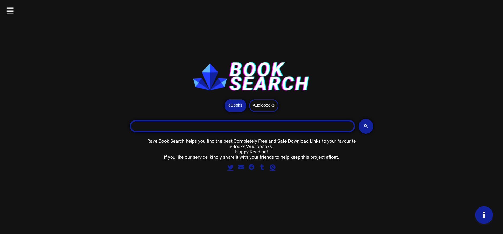
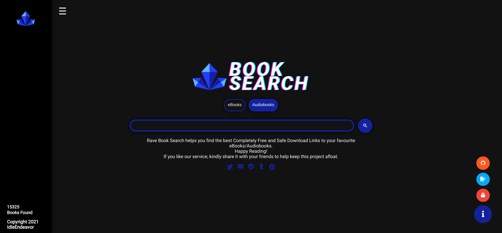

# Rave Book Search Engine
Rave is a simple search engine that assists in the discovery of free eBook/Audiobook download sites. It has a list of websites that are regularly updated and checked for eBook/Audiobook download links.
All of the websites listed by the Rave Book search engine have been thoroughly verified to ensure that they do not contain any malware or viruses.
Rave search engine is based on Google's custom search technology.

# Features
- Assists in the finding of free ebook/audiobook download links
- Only indexes links that have been verified and confirmed to be virus-free.
- Shows the amount of searches/visits done on the rave search website
- Uses Google custom search engine to provide results quickly
- Simple, material UI for easy use

# Websites Indexed (currently 36)
## eBooks
- manybooks.net
- freebooks.com
- ibookpile.net
- epdf.tips
- oceanofpdf.com
- ebookbb.com
- b-ok.asia
- gutenberg.org
- allbooksworld.com
- ebooklobby.com
- freetechbooks.com
- freecomputerbooks.com
- onlinebooks.library.upenn.edu
- grtbooks.com
- baen.com
- bygosh.com
- bookgoldmine.com
- libgen.fun
- libgen.rs/fiction
- pdfget.com
- yudhacookbook.my.id
- epublibre.org
- espaebook2.com
- standardebooks.org/books
- getcomics.info
- sanet.st/full
- ebook-hunter.org/books
- ebookelo.com
- freefullpdf.com
- snewd.com
- kupdf.net
- pdfroom.com
- lelivros.love
- trantor.is
- ikindlebooks.com
- dokumen.pub
## Audiobooks (currently 9)
- loyalbooks.com
- xaudiobo0ks.com
- audiobookbay.nl
- audiboi.com
- tokybook.com
- goldenaudiobooks.com
- galaxyaudiobook.com
- audiobooklabs.com
- audiobooks4soul.com

# Additional Info
## Terms of Use
The purpose of this website is to compile a list of ebook download links from external websites.
The user is responsible for any actions done in response to the Rave eBook Search Engine's results.
With its information, this website does not advocate or discourage any behaviors. This website contains only pure, unfettered material (excluding logos and other copyrighted content
IdleEndeavor owns the Rave eBook Search logo and all other brand material. External usage of this information is prohibited.

## Privacy Policy
The Rave eBook Search Engine does not collect or retain any personally identifiable information.
This website does not utilize Analytics in any way for its own purposes except a basic searches-completed counter, and its servers do not keep track of how it is used.
Rave eBook Search Engine's search functions are built on Google Search Services. As a result, Google may gather use or analytics data from visitors of this site. This data gathering is not the responsibility of Rave Search.
We realize you as a user's right to privacy and will strive to respect it at every step of the way, as much as we can.

## Licence
All of the code for the Rave search engine is available to the public and may be copied and modified for personal use.
IdleEndeavor owns all of the Rave search engine's brand material and logos. They must not be copied, changed, or utilized in conjunction with the copied search engine code or in any other way.
