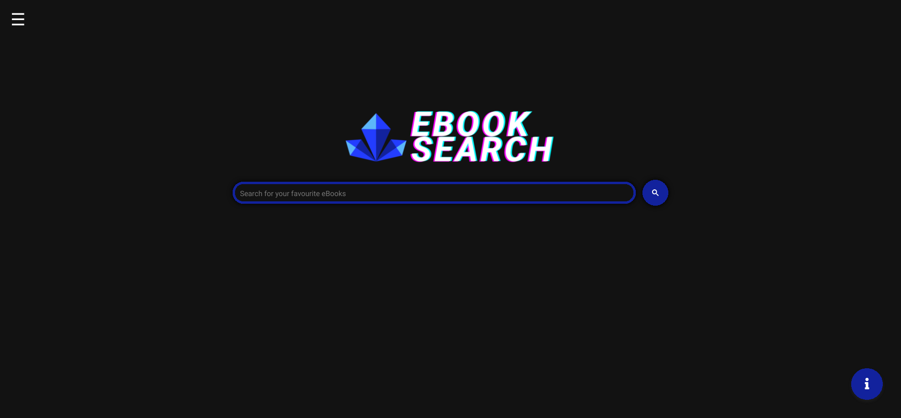
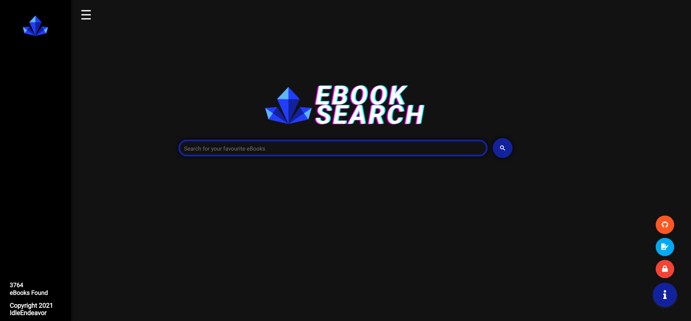

# Rave Game Search Engine
Rave is a simple search engine that assists in the discovery of free game download sites. It has a list of websites that are regularly updated and checked for video-game download links.
All of the websites listed by the Rave gaming search engine have been thoroughly verified to ensure that they do not contain any malware or viruses.
The Rave search engine is based on Google's custom search technology.

# Features
- Assists in the finding of free game download links
- Only indexes links that have been verified and confirmed to be virus-free.
- Shows the amount of searches/visits done on the rave search website
- Uses Google custom search engine to provide results quickly
- Simple, material UI for easy use

# Websites Indexed
### RG Mechanics

### All Games for You

### New Games Box

### Steam Unlocked

### OVA Games

### Fitgirl Repacks

# Terms of Use
The purpose of this website is to compile a list of video game download links from other websites.
The user is responsible for any actions done in response to the Rave Game Search engine's results.
With its information, this website does not advocate or discourage any behaviors. This website contains only pure, unfettered material (excluding logos and other copyrighted content
IdleEndeavor owns the Rave Game Search logo and all other brand material. External usage of this information is prohibited.

## Privacy Policy
The Rave Game Search Engine does not collect or retain any personally identifying information.
This website does not utilize Google Analytics in any way for its own purposes, and its servers do not keep track of how it is used.
Rave Game Search Engine's search functions are built on Google Search Services. As a result, Google may gather use or analytics data from visitors of this site. This data gathering is not the responsibility of Rave Search.

## Licence
All of the code for the Rave search engine is available to the public and may be copied and modified for personal use.
IdleEndeavor owns all of the Rave search engine's brand material and logos. They must not be copied, changed, or utilized in conjunction with the copied search engine code or in any other way.
